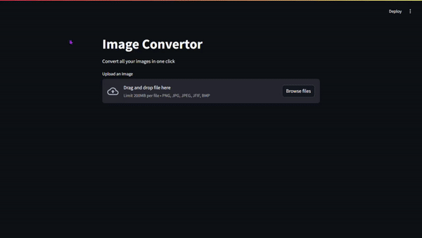

---

# 🖼️ Image Converter WebApp  

## Introduction  
The **Image Converter WebApp** is a user-friendly tool for converting image formats with ease. With just a few clicks, users can upload images and convert them into various formats directly in their browser.  

## 🛠️ Tech Stack  
- **Python**: Core programming language for the project.  
- **Streamlit**: For building the interactive web application.  
- **Pillow (PIL)**: For image processing.  

## ✨ Features  
- **🖼️ Image Upload**: Supports multiple image formats, including PNG, JPG, JPEG, JFIF, and BMP.  
- **🔄 Format Conversion**: Converts images into popular formats such as PNG, JPEG, JFIF, and BMP.  
- **📤 Image Preview**: Displays the uploaded image and its format.  
- **⬇️ Download Option**: Provides a download button for the converted image.  

## 🛤️ Process  
1. **File Upload**: Users upload an image file via a file uploader.  
2. **Image Preview**: The app displays the uploaded image along with its original format.  
3. **Format Selection**: Users choose a desired output format from the dropdown options.  
4. **Image Conversion**: Using the `convert_img_format` function, the app processes and converts the image.  
5. **Download Link**: Once converted, users can download the image in the selected format.  

## 🌱 What I’ve Learned  
- Building interactive web applications using Streamlit.  
- Utilizing Pillow (PIL) for advanced image manipulation.  
- Handling file uploads and downloads in Streamlit.  
- Improving the user experience with seamless image processing and UI responsiveness.  

## 🚀 Improvements  
- Add more advanced features like resizing or cropping images.  
- Support for additional formats like GIF or WebP.  
- Provide an option to adjust image quality for optimized file size.  
- Add a dark mode for better user accessibility.  

## 💻 Running the Project  
1. **Clone the repository**:  
   ```bash  
   git clone https://github.com/Lawani-EJ/Image-Convertor  
   ```  
2. **Navigate to the project directory**:  
   ```bash  
   cd Image-Convertor  
   ```  
3. **Install dependencies**:  
   ```bash  
   pip install -r requirements.txt  
   ```  
4. **Run the Streamlit app**:  
   ```bash  
   streamlit run app.py  
   ```  
5. **Access the app** in your browser at `http://localhost:8501`.  

## 🎥 Video and 📸 Screenshot  
- **🎥 Video Demo**:  
    
- **📸 Screenshot**:  
  .png)  

## 🙏 Thank You  
Thank you for exploring the **Image Converter WebApp**! 💖 If you found this helpful or have suggestions for improvements, feel free to contribute or leave feedback. Your support is appreciated! 🚀  

---  
